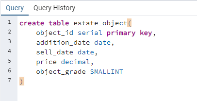
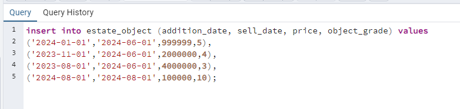
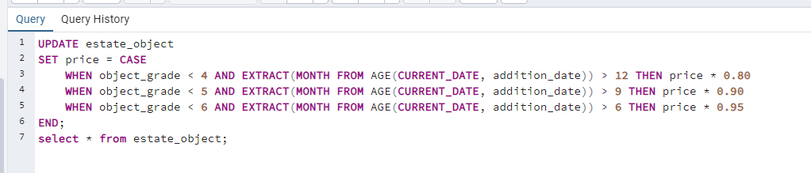
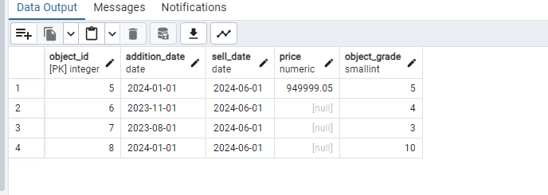
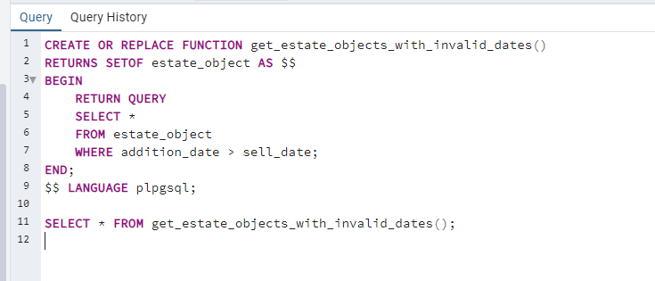
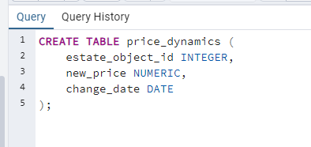
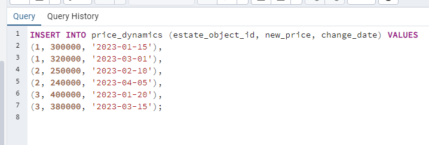
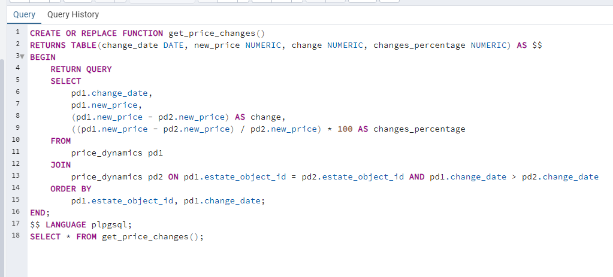
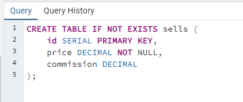
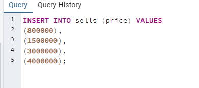

# Практика №1

### Задание 1

Создание таблицы:



Добваление данных:


```sql
insert into estate_object (addition_date, sell_date, price, object_grade) values
('2024-01-01','2024-06-01',999999,5),
('2023-11-01','2024-06-01',2000000,4),
('2023-08-01','2024-06-01',4000000,3),
('2024-01-01','2024-06-01',10000000,10);
```


Создание функции:


```sql
UPDATE estate_object
SET price = CASE
    WHEN object_grade < 4 AND EXTRACT(MONTH FROM AGE(CURRENT_DATE, addition_date)) > 12 THEN price * 0.80
    WHEN object_grade < 5 AND EXTRACT(MONTH FROM AGE(CURRENT_DATE, addition_date)) > 9 THEN price * 0.90
    WHEN object_grade < 6 AND EXTRACT(MONTH FROM AGE(CURRENT_DATE, addition_date)) > 6 THEN price * 0.95
END;
```

Измененные данные:



### Задание 2



```sql
CREATE OR REPLACE FUNCTION get_estate_objects_with_invalid_dates()
RETURNS SETOF estate_object AS $$
BEGIN
    RETURN QUERY
    SELECT *
    FROM estate_object
    WHERE addition_date > sell_date;
END;
$$ LANGUAGE plpgsql;

SELECT * FROM get_estate_objects_with_invalid_dates();
```


### Задание 3

Создание таблицы:

```sql
CREATE TABLE price_dynamics (
    estate_object_id INTEGER,
    new_price NUMERIC,
    change_date DATE
);
```


Заполнение данными:

```sql
INSERT INTO price_dynamics (estate_object_id, new_price, change_date) VALUES
(1, 300000, '2023-01-15'),
(1, 320000, '2023-03-01'),
(2, 250000, '2023-02-10'),
(2, 240000, '2023-04-05'),
(3, 400000, '2023-01-20'),
(3, 380000, '2023-03-15');
```


Создание функции:

```sql
CREATE OR REPLACE FUNCTION get_price_changes()
RETURNS TABLE(change_date DATE, new_price NUMERIC, change NUMERIC, changes_percentage NUMERIC) AS $$
BEGIN
    RETURN QUERY
    SELECT
        pd1.change_date,
        pd1.new_price,
        (pd1.new_price - pd2.new_price) AS change,
        ((pd1.new_price - pd2.new_price) / pd2.new_price) * 100 AS changes_percentage
    FROM
        price_dynamics pd1
    JOIN
        price_dynamics pd2 ON pd1.estate_object_id = pd2.estate_object_id AND pd1.change_date > pd2.change_date
    ORDER BY
        pd1.estate_object_id, pd1.change_date;
END;
$$ LANGUAGE plpgsql;
SELECT * FROM get_price_changes();
```


### Задание 4


### Задание 5

Создание таблицы:

```sql
CREATE TABLE IF NOT EXISTS sells (
    id SERIAL PRIMARY KEY,
    price DECIMAL NOT NULL,
    commission DECIMAL
);

```

Добавление данных:

```sql
INSERT INTO sells (price) VALUES
(800000),
(1500000),
(3000000),
(4000000);
```

Создание функции:

```sql
CREATE OR REPLACE FUNCTION calculate_commission()
RETURNS VOID AS $$
DECLARE
    sale_record RECORD;
BEGIN
    FOR sale_record IN SELECT * FROM sells LOOP
        IF sale_record.price < 1000000 THEN
            UPDATE sells
            SET commission = sale_record.price * 0.02
            WHERE id = sale_record.id;
        ELSIF sale_record.price >= 1000000 AND sale_record.price < 3000000 THEN
            UPDATE sells
            SET commission = sale_record.price * 0.019
            WHERE id = sale_record.id;
        ELSE
            UPDATE salls
            SET commission = sale_record.price * 0.017
            WHERE id = sale_record.id;
        END IF;
    END LOOP;
END;
$$ LANGUAGE plpgsql;
```
